# 👟 NOVA – Premium Sneaker E-Commerce Platform

A modern **Full Stack E-Commerce Website** built using **Next.js**, **React.js**, **MongoDB Atlas**, and **Tailwind CSS**. NOVA provides a seamless shopping experience for customers along with a powerful Admin Dashboard for product and order management.

---
# Highlights
- Full Stack E-Commerce Website
- Next.js + React + MongoDB Atlas
- Shopping Cart & Checkout
- Admin Dashboard
- Product & Order Management
- Responsive Design

## ✨ Features

### 🛍️ Customer Features

- Browse premium sneaker collection
- Search products
- Filter products by brand
- View detailed product information
- Add products to cart
- Increase & decrease product quantity
- Dynamic cart total calculation
- Checkout with customer details
- Order placement
- Order success page
- Responsive user interface

---

### 👑 Admin Features

- Secure Admin Login
- Add Products
- Edit Products
- Delete Products
- View All Products
- View Customer Orders
- Update Order Status
  - Pending
  - Confirmed
  - Shipped
  - Delivered

---

## 🗄️ Backend Features

- MongoDB Atlas Integration
- Product CRUD Operations
- Order Management System
- REST API using Next.js API Routes
- Dynamic Product Fetching
- Dynamic Order Fetching

---

## 🛠️ Tech Stack

### Frontend
- Next.js
- React.js
- Tailwind CSS
- Context API

### Backend
- Next.js API Routes
- MongoDB Atlas

### Database
- MongoDB

---

# 📸 Project Screenshots

## 🏠 Landing Page

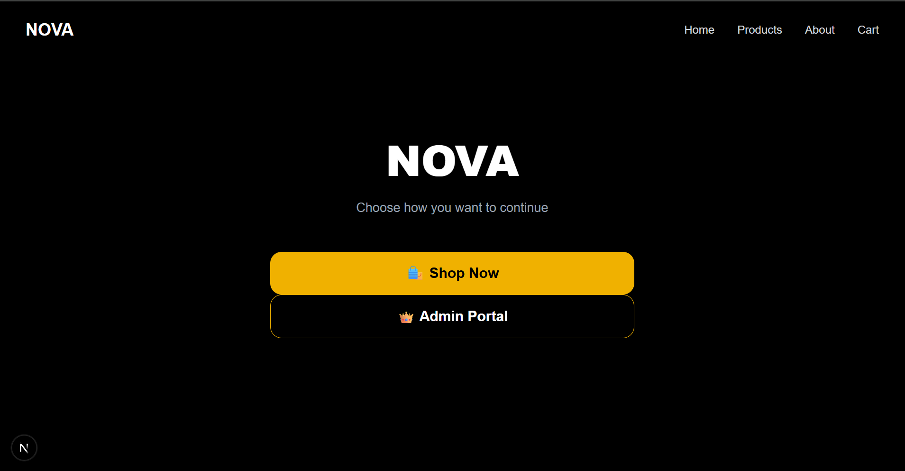

---

## 🏡 Home Page


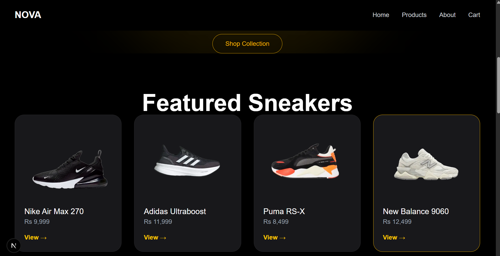
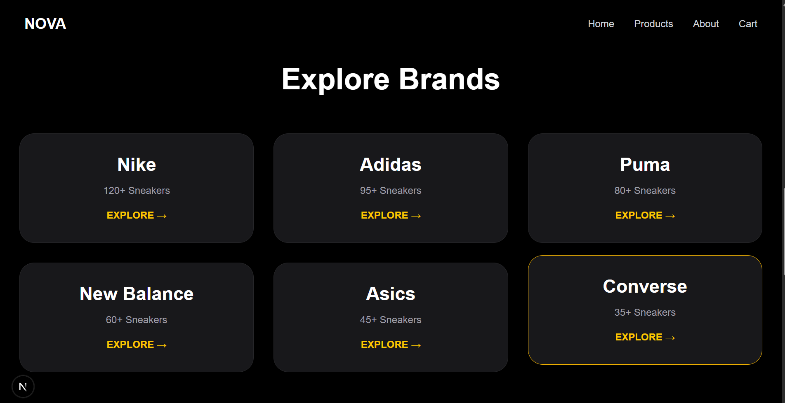
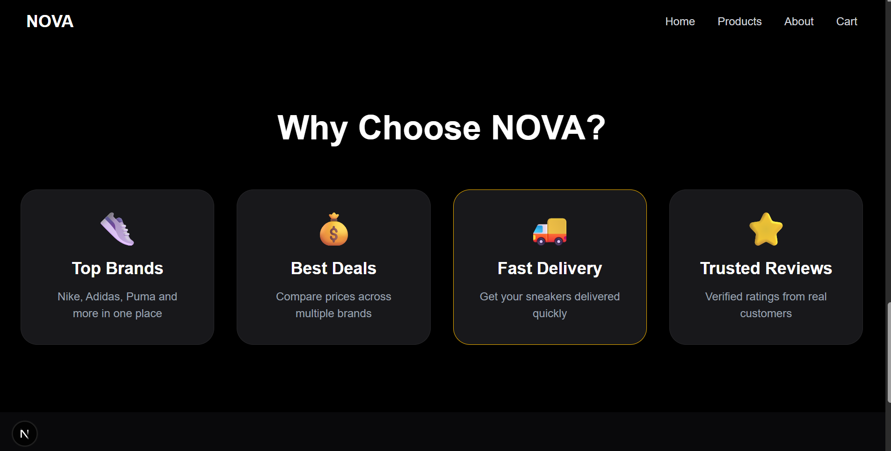


---

## 👟 Products Page

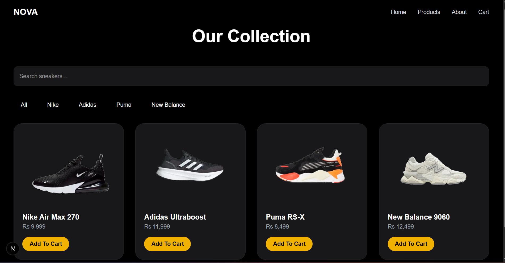

---

## 🔍 Search & Filter


---

## 📄 Product Details

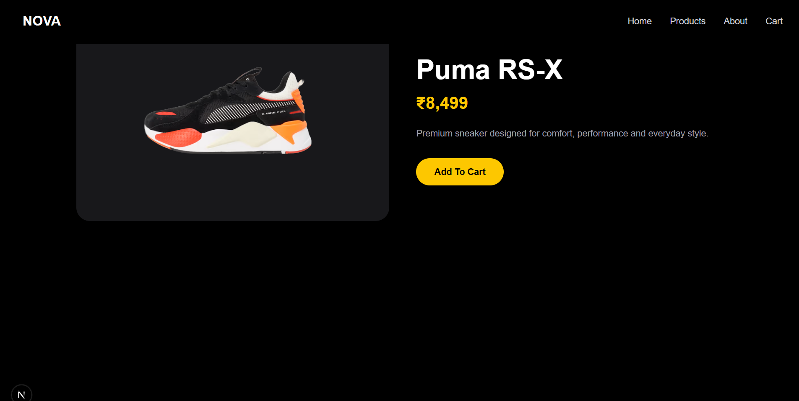

---

## 🛒 Shopping Cart

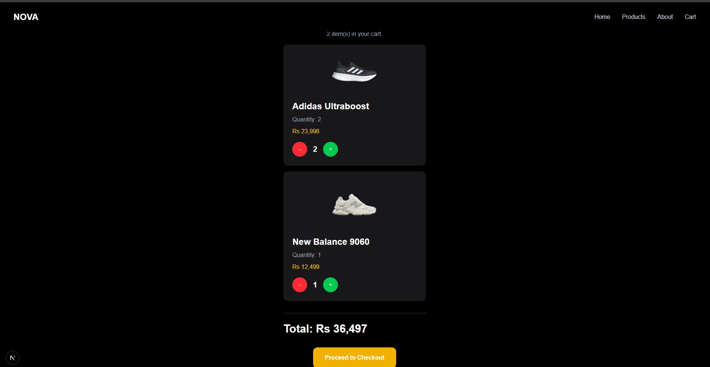

---

## 💳 Checkout

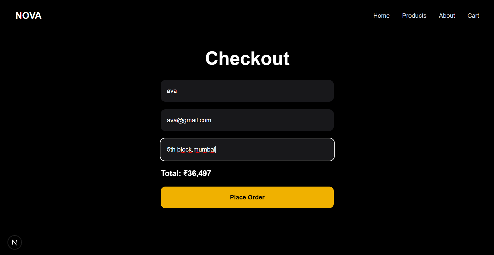

---

## 🎉 Order Success

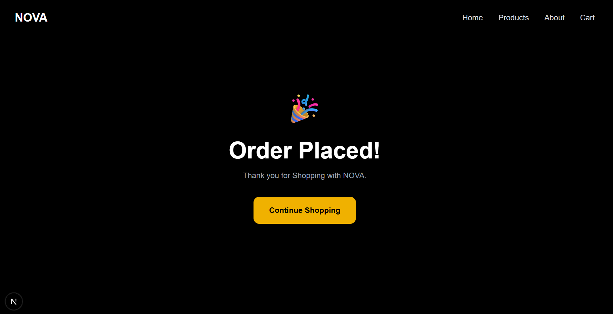

---

## 🔐 Admin Login

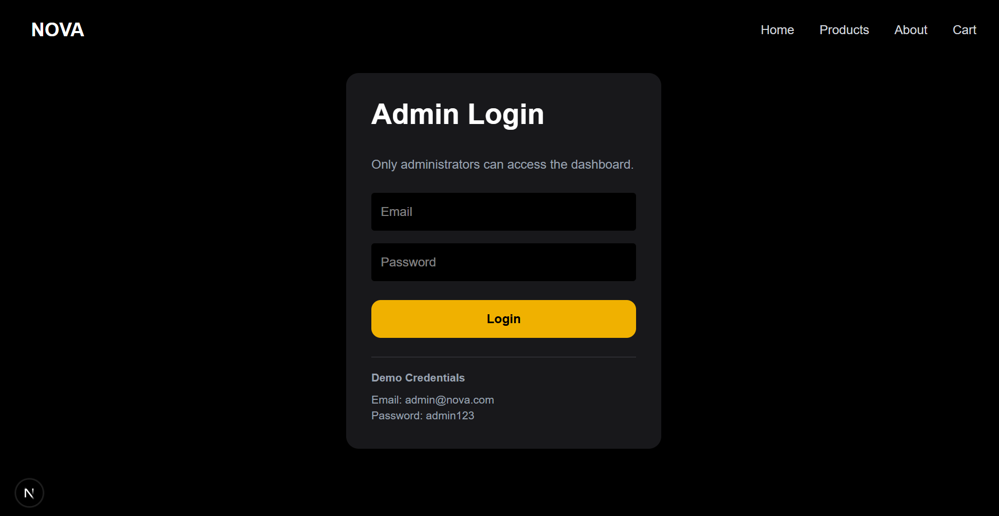

---

## ⚙️ Admin Dashboard

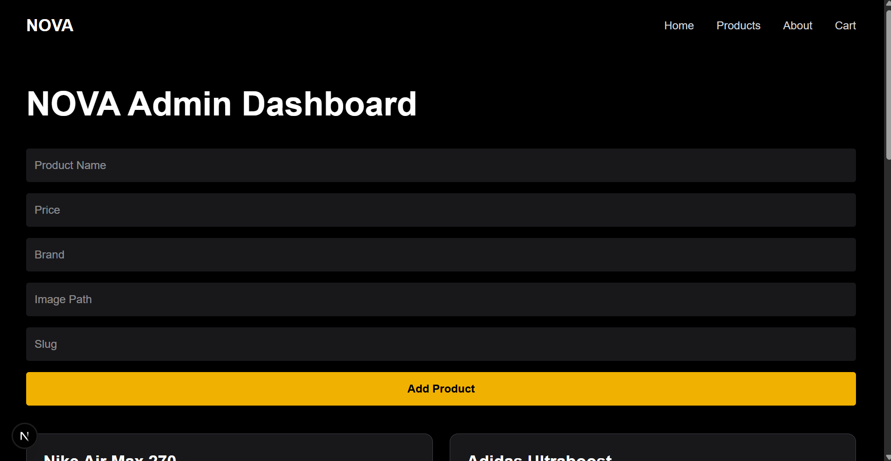

---

## 📦 Order Management

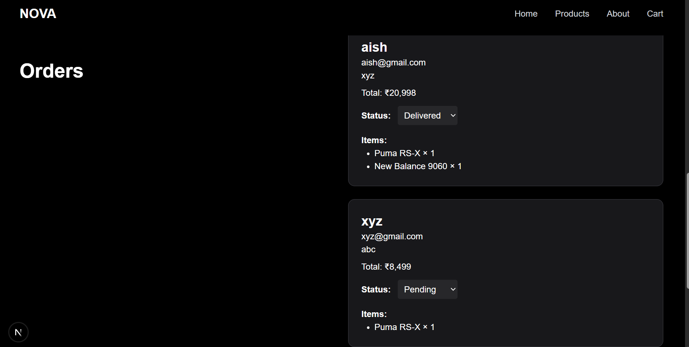

---

# 📂 Project Structure

```
NOVA
│
├── screenshots
├── public
├── src
│   ├── app
│   │   ├── admin
│   │   ├── api
│   │   │   ├── products
│   │   │   └── orders
│   │   ├── cart
│   │   ├── checkout
│   │   ├── home
│   │   ├── login
│   │   ├── products
│   │   └── success
│   │
│   ├── components
│   ├── context
│   └── lib
│
├── package.json
└── README.md
```

---

# 🚀 Installation

Clone the repository

```bash
git clone https://github.com/aishwarya-thorat/nova-store.git
```

Go inside the project

```bash
cd nova-store
```

Install dependencies

```bash
npm install
```

Create a `.env.local` file

```env
MONGODB_URL=your_mongodb_connection_string
```

Run the development server

```bash
npm run dev
```

Open

```
http://localhost:3000
```

---

# ✅ Internship Deliverables Completed

- ✅ Product Catalog
- ✅ Product Search
- ✅ Product Filtering
- ✅ Shopping Cart
- ✅ Quantity Management
- ✅ Checkout Flow
- ✅ Backend for Product Management
- ✅ Backend for Order Management
- ✅ MongoDB Database Integration
- ✅ Admin Dashboard
- ✅ Product CRUD Operations
- ✅ Order Management System
- ✅ Dynamic Product Rendering
- ✅ Responsive Design

---

# 🔮 Future Enhancements

- Stripe Payment Gateway
- User Authentication with Database
- Wishlist
- Order History
- Product Reviews & Ratings
- Email Notifications
- Sales Analytics Dashboard
- Inventory Tracking

---

# 👩‍💻 Developed By

**Aishwarya Thorat**

Third Year Computer Engineering Student

Built as a Full Stack Internship Project using **Next.js**, **MongoDB Atlas**, **React.js**, and **Tailwind CSS**.

---

## ⭐ If you like this project

Please consider giving this repository a ⭐ on GitHub.